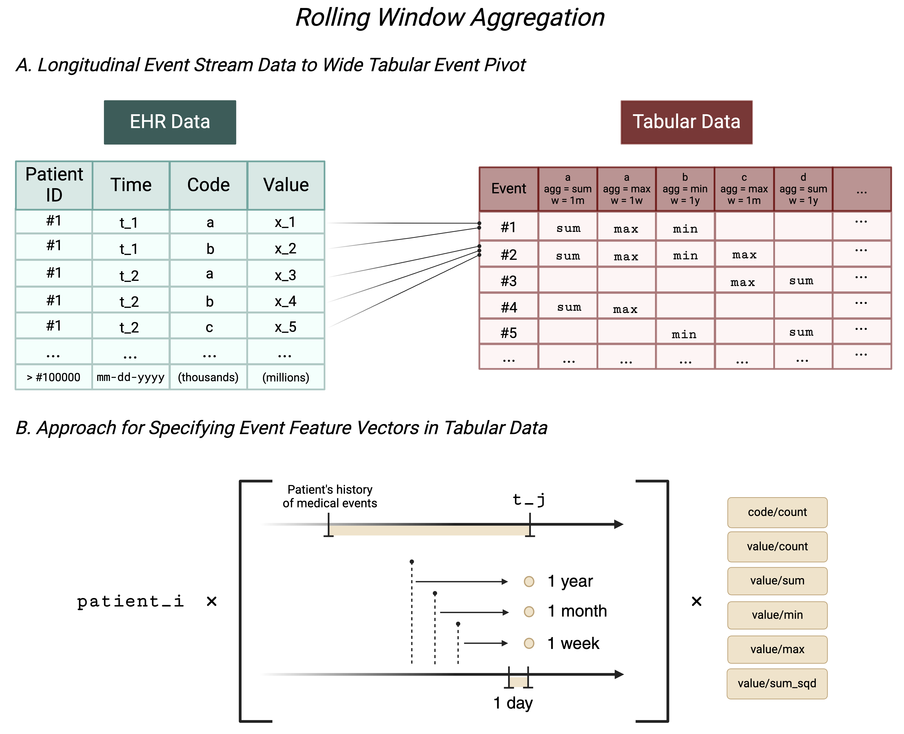

# The MEDS-Tab Architecture

In this section, we describe the MEDS-Tab architecture, specifically some of the pipeline choices we made to reduce memory usage and increase speed during the tabularization process and XGBoost tuning process.

We break our method into 4 discrete parts:

1. Describe codes (compute feature frequencies)
2. Tabularization of time-series data
3. Efficient data caching for task-specific rows
4. XGBoost training

## 1. Describe Codes (compute feature frequencies)

This initial stage processes a pre-shareded dataset. We expect a structure as follows where each shard contains a subset of the patients:

```text
/PATH/TO/MEDS/DATA
│
└─── <SPLIT A>
│   │   <SHARD 0>.parquet
│   │   <SHARD 1>.parquet
│   │   ...
│
└─── <SPLIT B>
│   │   <SHARD 0>.parquet
│   │   <SHARD 1>.parquet
|   │   ...
|
...
```

We then compute and store feature frequencies, crucial for determining which features are relevant for further analysis.

**Detailed Workflow:**

- **Data Loading and Sharding**: We iterate through shards to compute feature frequencies for each shard.
- **Frequency Aggregation**: After computing frequencies across shards, we aggregate them to get a final count of each feature across the entire dataset training dataset, which allows us to filter out infrequent features in the tabularization stage or when tuning XGBoost.

## 2. Tabularization of Time-Series Data

### Overview

The tabularization stage of our pipeline, exposed via the cli commands:

- `meds-tab-tabularize-static` for tabularizing static data
- and `meds-tab-tabularize-time-series` for tabularizing the time series data

Static data is relatively small in the medical datasets, so we use a dense pivot operation, convert it to a sparse matrix, and then duplicate rows such that the static data will match up with the time series data rows generated in the next step. Static data is currently processed serially.

The script for tabularizing time series data primarily transforms a raw, unstructured dataset into a structured, feature-rich dataset by utilizing a series of sophisticated data processing steps. This transformation (as depicted in the figure below) involves converting raw time series from a Polars dataframe into a sparse matrix format, aggregating events that occur at the same date for the same patient, and then applying rolling window aggregations to extract temporal features.



### High-Level Tabularization Algorithm

1. **Data Loading and Categorization**:

   - The script iterates through shards of patients, and shards can be processed in parallel using hydras joblib to launch multiple processes.

2. **Sparse Matrix Conversion**:

   - Data from the Polars dataframe is converted into a sparse matrix format, where each row represents a unique event (patient x timestamp), and each column corresponds to a MEDS code for the patient.

3. **Rolling Window Aggregation**:

   - For each aggregation method (sum, count, min, max, etc.), events that occur on the same date for the same patient are aggregated. This reduces the amount of data we have to perform rolling windows over.
   - Then we aggregate features over the specified rolling windows sizes.

4. **Output Storage**:

   - Sparse array is converted to Coordinate List format and stored as a `.npz` file on disk.
   - The file paths look as follows

```text
/PATH/TO/MEDS/TABULAR_DATA
│
└─── <SPLIT A>
    ├─── <SHARD 0>
    │   ├───code
    │   │   └───count.npz
    │   └───value
    │       └───sum.npz
    ...
```

## 3. Efficient Data Caching for Task-Specific Rows

Now that we have generated tabular features for all the events in our dataset, we can cache subsets relevant for each task we wish to train a supervised model on. This step is critical for efficiently training machine learning models on task-specific data without having to load the entire dataset.

**Detailed Workflow:**

- **Row Selection Based on Tasks**: Only the data rows that are relevant to the specific tasks are selected and cached. This reduces the memory footprint and speeds up the training process.
- **Use of Sparse Matrices for Efficient Storage**: Sparse matrices are again employed here to store the selected data efficiently, ensuring that only non-zero data points are kept in memory, thus optimizing both storage and retrieval times.

The file structure for the cached data mirrors that of the tabular data, also consisting of `.npz` files, where users must specify the directory that stores labels. Labels follow the same shard filestructure as the input meds data from step (1), and the label parquets need `subject_id`, `timestamp`, and `label` columns.

## 4. XGBoost Training

The final stage uses the processed and cached data to train an XGBoost model. This stage is optimized to handle the sparse data structures produced in earlier stages efficiently.

**Detailed Workflow:**

- **Iterator for Data Loading**: Custom iterators are designed to load sparse matrices efficiently into the XGBoost training process, which can handle sparse inputs natively, thus maintaining high computational efficiency.
- **Training and Validation**: The model is trained using the tabular data, with evaluation steps that include early stopping to prevent overfitting and tuning of hyperparameters based on validation performance.
- **Hyperaparameter Tuning**: We use [optuna](https://optuna.org/) to tune over XGBoost model pramters, aggregations, window sizes, and the minimimum code inclusion frequency.
